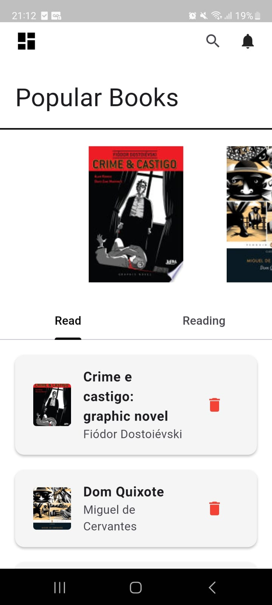
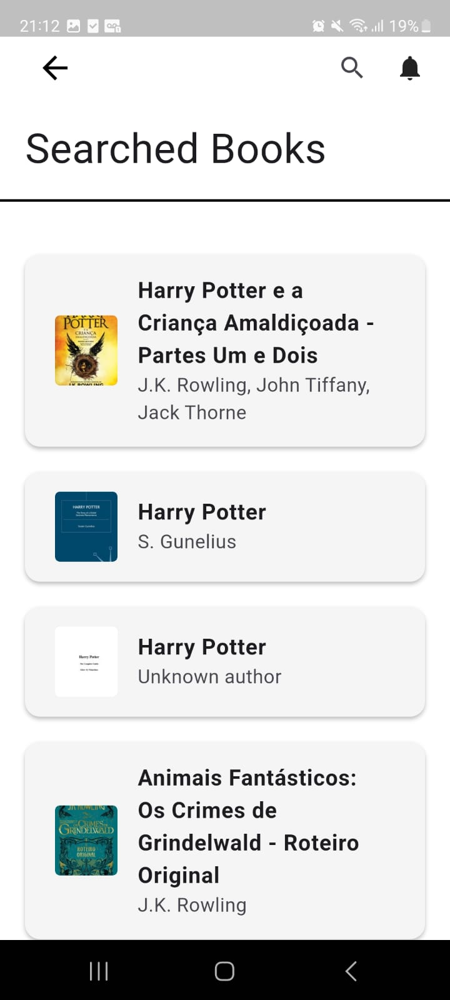
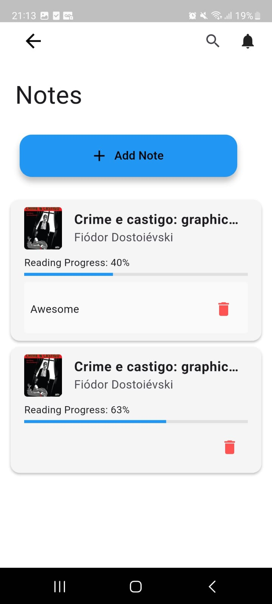

# 📚 Virtual Library

Virtual Library is a personal virtual library app built with Flutter. It allows users to manage their reading journey by searching for books, tracking progress, and adding personal notes.

## ✨ Features

🔎 Search for books by title, author, or category

📌 Mark books as Reading or Read

📝 Add and view personal notes while reading

📚 Explore a carousel of the most popular books

🧾 View a list of books you are currently reading or have finished

## 📸 Screenshots

🏠 Main Page
Displays your reading and read books, along with a carousel of popular titles.

🔍 Search Page
Search for books by keyword.

📘 Book Description
Detailed view of the selected book, including title, author, and summary.

📝 Book Notes
Section for adding and managing personal notes during your reading.

## 🧰 Tech Stack

- 🔹 Flutter
- 🔸 Dart
- 🔗 Google Books API – for fetching book data
- 🗃️ sqflite – for local SQLite database